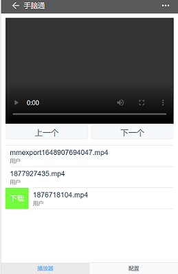

# 手脑通

一个网页播放器。

在 A 电脑启动应用,通过浏览器的形式,您可以在其它设备播放 A 电脑中的本地视频,同时提供了上传、下载、删除功能、读取本地视频的功能

## 启动

`npm install`

windows 系统双击根目录的 start.bat

## 文件目录

只支持设置"系统"和"用户"两种形式的路径。

默认是"c://sf-mobile-web/player/system/movie"和"c://sf-mobile-web/player/user/movie"和

在"service/app/data/api/player/player/lifeCycle.js"中可以修改位置

"系统"目录用来存储电脑上的本地视频,由使用者自行存放。"用户"目录用来存储使用者上传的视频,也可以用来存放带后缀的视频格式。

"用户"目录下的文件可以转移到'系统'目录
